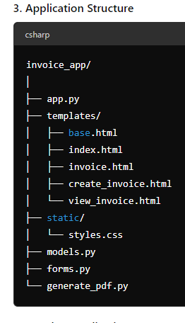
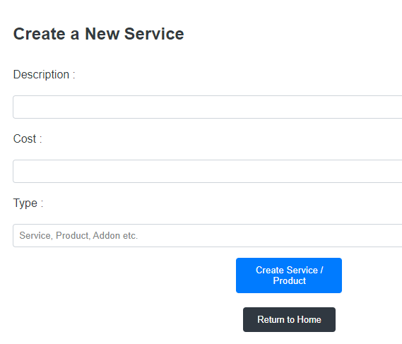
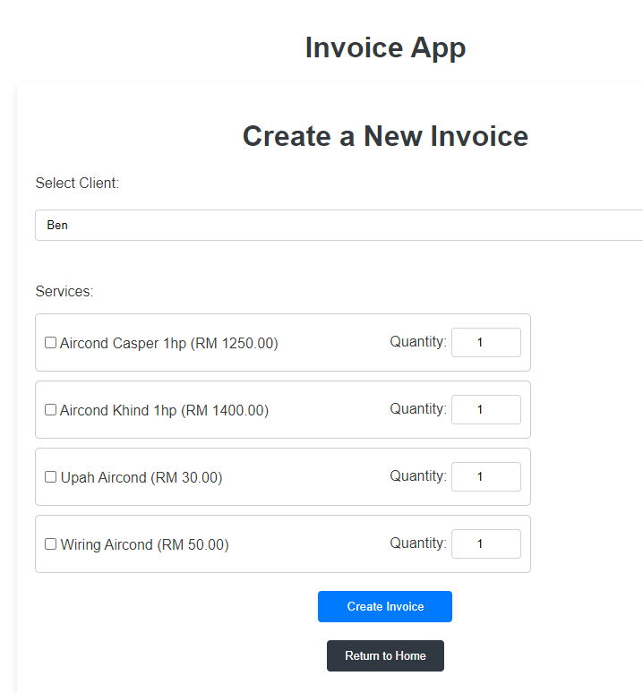

### Invoice APP
This is a simple invoice app that allows you to create, read, update and delete invoices. It is built using Flask and SQLite database. The app is structured in such a way that it follows the MVC pattern. The app has a simple UI that allows you to interact with the app. The app is built using the following technologies:
- Flask
- SQLite
- HTML
- CSS
  

Here are the structure of the folder:

### How to run the app
1. Clone the repository
2. Create a virtual environment and activate it
3. Install the requirements using `pip install -r requirements.txt`
4. Run the app using `python app.py`
5. Open the browser and navigate to `http://127.0.0.1:5000/`
6. You have to create client and service before you can create an invoice.

Few interfaces of the app:
1. How to create service for the invoice:
   
    

1. How to create invoice:
    